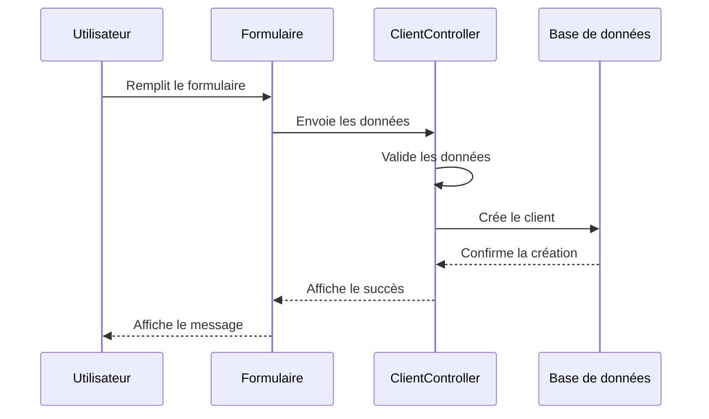
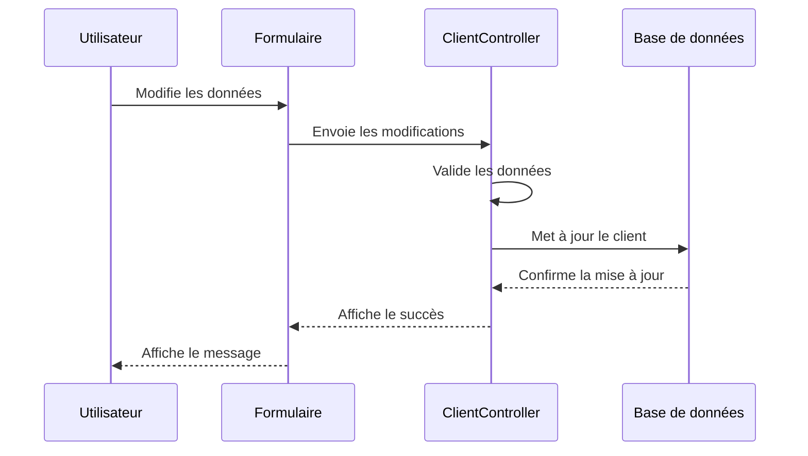
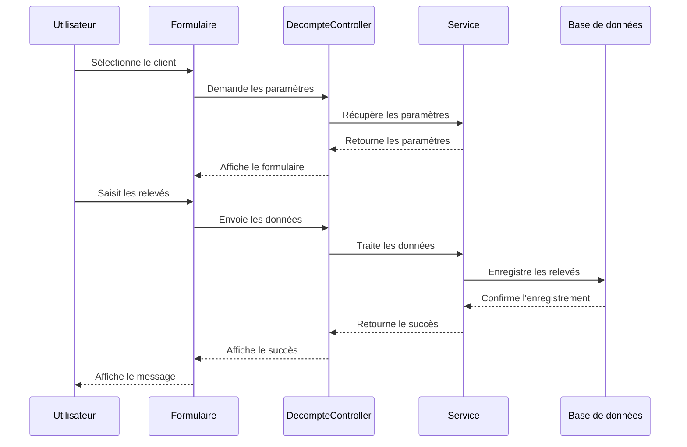
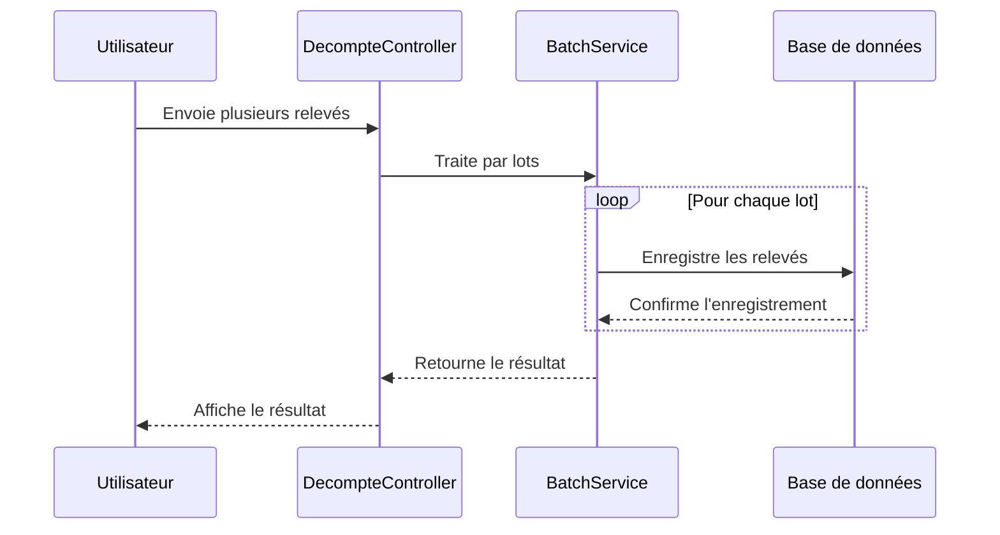
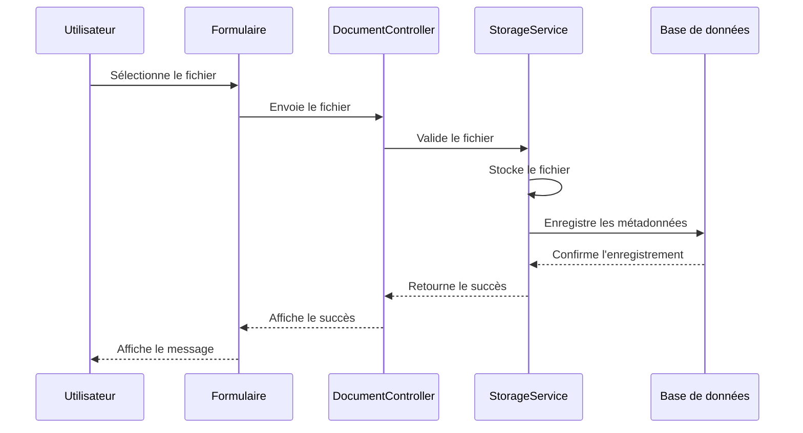
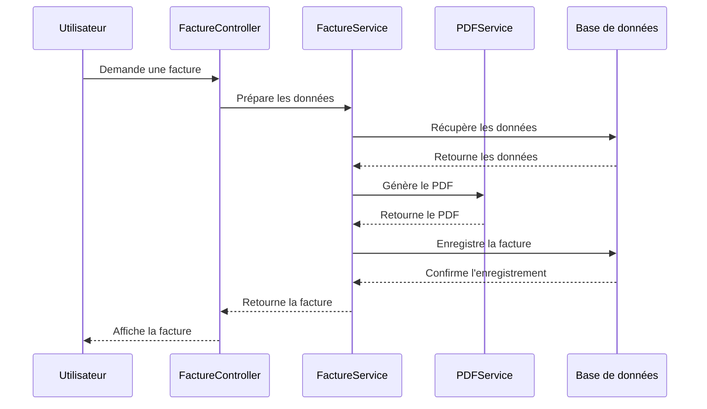
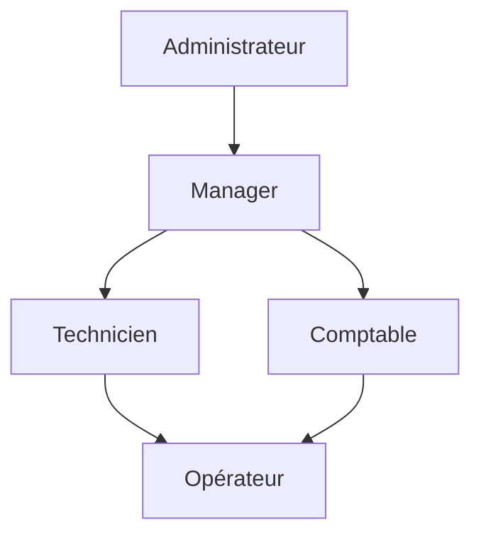

# Documentation des Workflows Métier AquaLara

## Table des matières
1. [Gestion des Clients](#gestion-des-clients)
2. [Gestion des Relevés](#gestion-des-relevés)
3. [Gestion des Documents](#gestion-des-documents)
4. [Gestion des Factures](#gestion-des-factures)

## Gestion des Clients

### Création d'un Client

### Modification d'un Client

## Gestion des Relevés

### Saisie des Relevés

### Traitement par Lots

## Gestion des Documents

### Upload de Documents

## Gestion des Factures

### Génération de Factures

## Rôles et Permissions

### Hiérarchie des Rôles

### Matrice des Permissions
| Action | Admin | Manager | Technicien | Comptable | Opérateur |
|--------|-------|---------|------------|-----------|-----------|
| Gestion Clients | ✓ | ✓ | ✓ | ✗ | ✗ |
| Saisie Relevés | ✓ | ✓ | ✓ | ✗ | ✓ |
| Gestion Documents | ✓ | ✓ | ✓ | ✓ | ✗ |
| Génération Factures | ✓ | ✓ | ✗ | ✓ | ✗ |
| Configuration Système | ✓ | ✗ | ✗ | ✗ | ✗ |